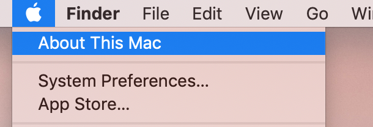
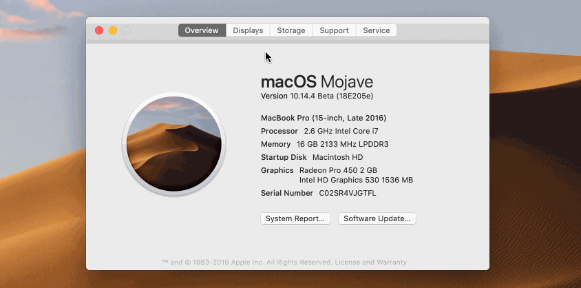
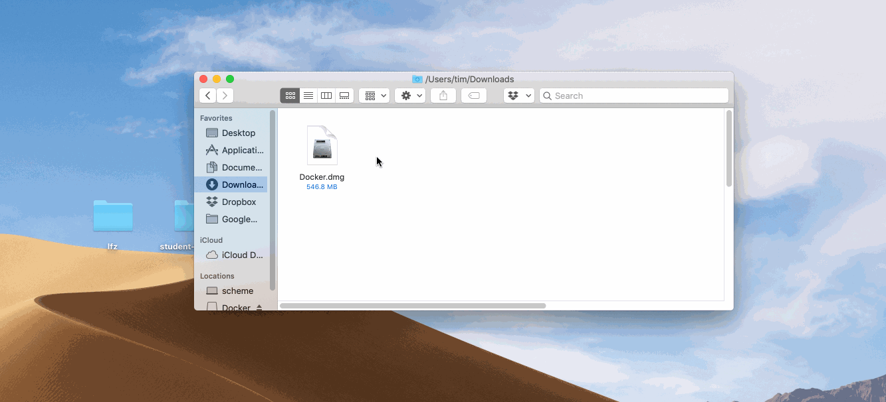
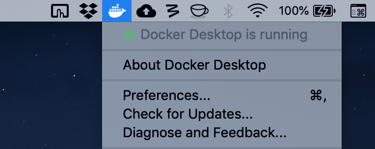
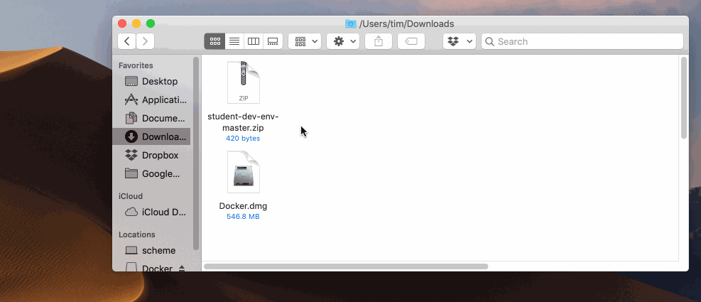
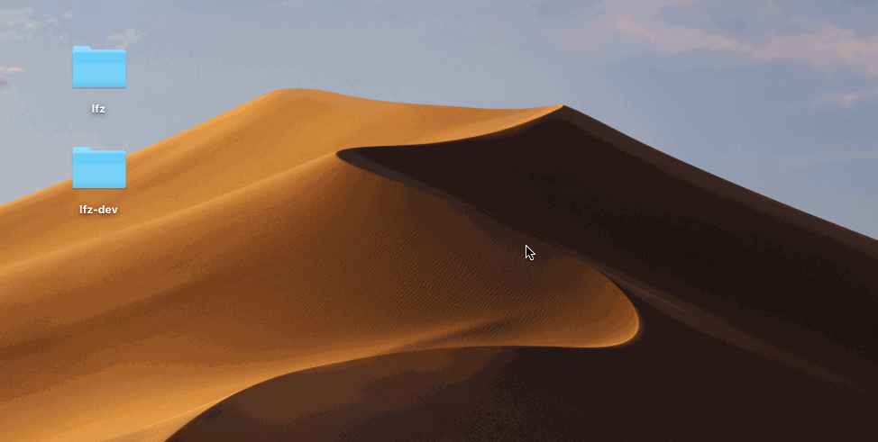
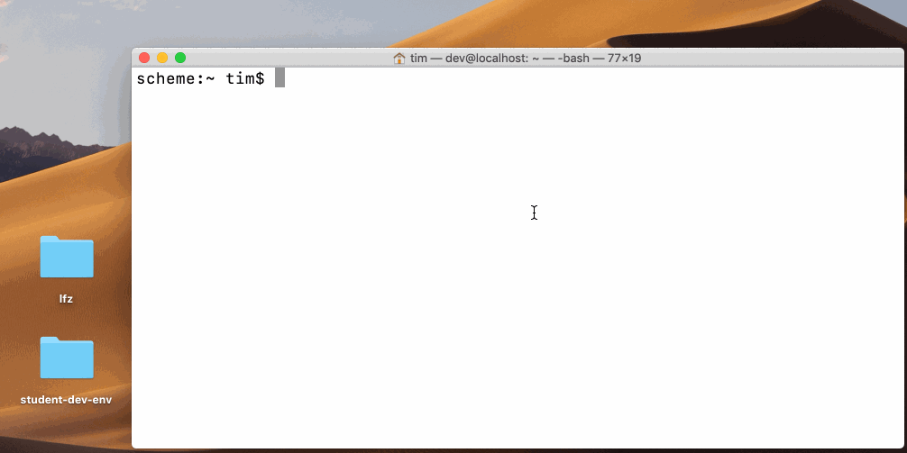
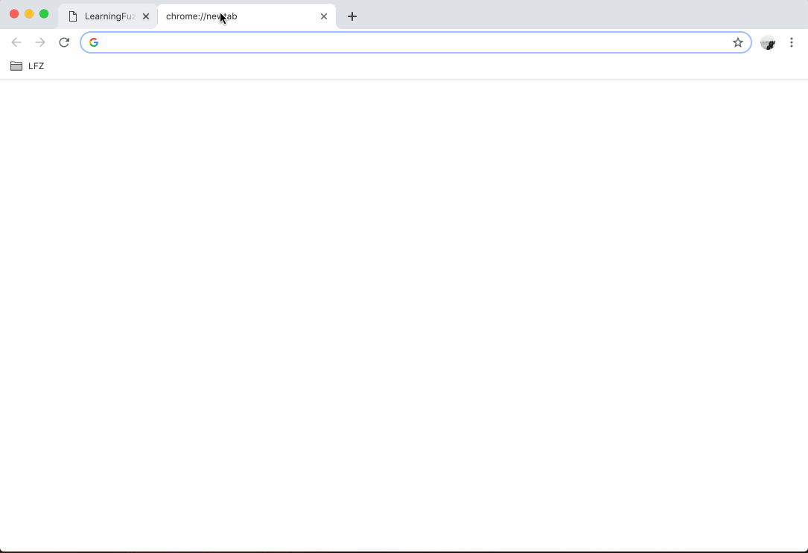
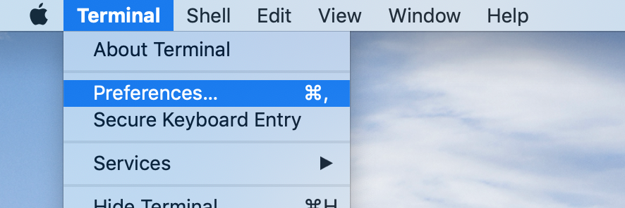
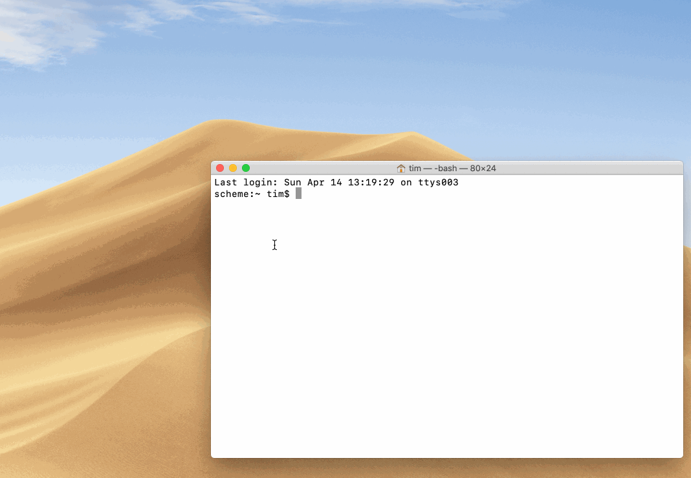

# MacOS Instructions

This guide provides instructions for setting up your Mac for development. Please note that although many parts of the instructions include helpful images an animations, the instructions **must** be read and followed step-by-step to ensure correct setup.

## Double-checking System Requirements

- **MacOS Version 10.12** or later
- 8 GB RAM
- 10 GB free disk space

Information about your computer can be found by opening the apple () menu and clicking "About This Mac". To see the available disk space, click the "Storage" tab.

**Note:** If you have less than 10 GB of available disk space, you can move your media files to a personal external hard drive or another home computer. Additional space can be freed by uninstalling applications not needed for your work, studies, or LearningFuze instruction.




---

## Installing Docker

**Note:** Creating a DockerHub account is not required to install and use Docker. You can safely ignore or dismiss all prompts to sign into DockerHub.

1. Download **Docker for Mac** at <a href="https://download.docker.com/mac/stable/31259/Docker.dmg" _target="blank">https://download.docker.com/mac/stable/31259/Docker.dmg</a>
2. Install Docker by opening the `.dmg` file you just downloaded and dragging Docker to your Applications. Then close the installer window.
3. Open your Applications folder in Finder and open the Docker application.
4. If prompted, continue opening Docker and provide the password you use to log into your Mac.
5. Within a few moments, the status bar at the top-right of your screen should have a Docker whale icon in it.
6. Click on the Docker whale icon to check that "**Docker Desktop is running**".
7. Then click "**Preferences...**" and ensure that "**Start Docker Desktop when you log in**" is _checked_ and "**Automatically check for updates**" is _unchecked_.




---

## Getting the Environment Installer

1. Download the installation files <a href="https://github.com/Learning-Fuze/lfz-dev/archive/master.zip" target="_blank">here</a>.
2. Move the downloaded zip file to your Desktop and unzip it.
3. Rename the unzipped folder to `lfz-dev`.

.

---

## Setting Up the Environment

1. Ensure that there is a folder on your Desktop named `lfz`.
2. Open a new Terminal window by pressing `Command (⌘) + Space`, typing Terminal, and pressing `Enter`.
3. Paste the following command into your Terminal and press `Enter`. This may take a while!

```bash
bash ~/Desktop/lfz-dev/__env__/macos/install.bash
```


---

## Entering and Exiting the Development Environment

1. Close your Terminal window.
2. Open a new Terminal window by pressing `Command (⌘) + Space`, typing Terminal, and pressing `Enter`.
3. Type `lfz-dev` and press enter. Your prompt should change.
4. Type `whoami` and press `Enter`. The output should be `dev`.
5. Type `ls` and press `Enter`. The output should include `Desktop`.
6. Type `exit` and press `Enter` to exit the development environment and return to your normal Terminal session.
7. To return to the development environment, type `lfz-dev` and press `Enter`.



---

## Testing Your Environment

1. Enter the development environment and run the following commands. You should see an HTML document that includes a success message.
```shell
sudo service apache2 start
sudo service mysql start
http localhost
```
2. Open your web browser and go to `http://localhost`. You should see the same HTML document, but presented to you as a web page.
3. Open a new tab in your web browser and go to `http://localhost/phpmyadmin` and log in with the username `root` and the password `root`.




The Apache Web Server and MySQL Database Server are not started automatically when you enter the development environment. They may already be running, but you'll want to learn the following commands to check, start, or stop them.

```shell
# to check if Apache is started
sudo service apache2 status

# to start Apache
sudo service apache2 start

# to stop Apache
sudo service apache2 stop

# to check if MySQL is started
sudo service mysql status

# to start MySQL
sudo service mysql start

# to stop MySQL
sudo service mysql stop
```

## Enhancing Terminal's Appearance

The default appearance of the Terminal app can make it a bit difficult to use. The font is very small and the black-on-white color scheme can become fatiguing over time. Fortunately, `lfz-dev` comes with some customization that you can apply to your Terminal.

1. Open the Terminal app by pressing `Command (⌘) + Space`, typing Terminal, and pressing `Enter`.
2. Open Terminal's Preferences and select the Profiles pane. There should be a list of color themes in the left column.
3. At the bottom of the themes list, click the small gear icon and select `Import...`
4. Navigate to `Desktop > lfz-dev > __env__ > macos` and choose `lfz.terminal`.
5. Select the `lfz` theme from your themes list and click Default to set it as your Terminal's default theme.
6. The next time you open a Terminal window, the new theme should be applied.



