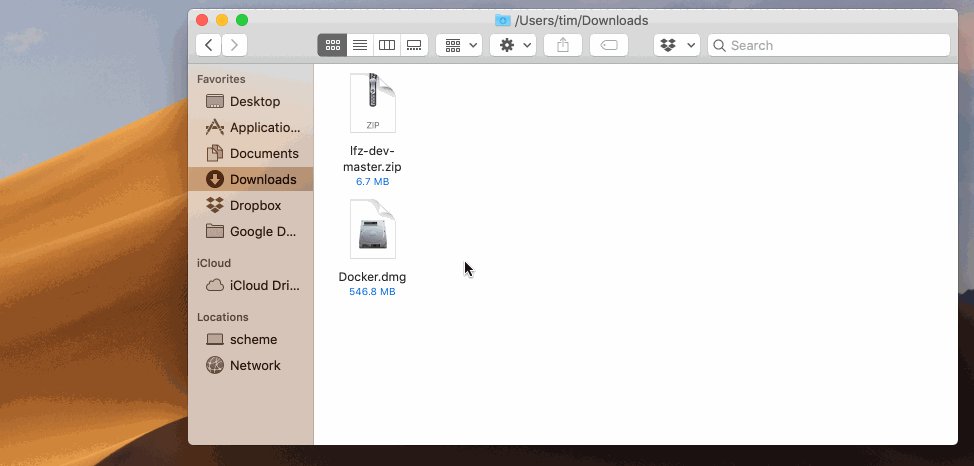
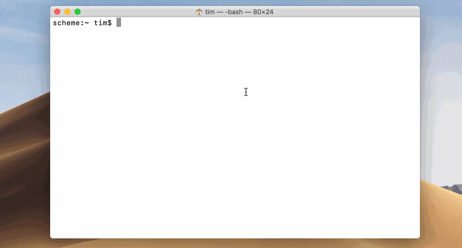

# MacOS Instructions


## Install Docker

1. Download **Docker for Mac** at <a href="https://download.docker.com/mac/stable/31259/Docker.dmg" _target="blank">https://download.docker.com/mac/stable/31259/Docker.dmg</a>
2. Install Docker by opening the `.dmg` file you just downloaded and dragging Docker to your Applications. Then close the installer window.
3. Open your Applications folder in Finder and open the Docker application.
4. If prompted, continue opening Docker and provide the password you use to log into your Mac.
5. The status bar at the top-right of your screen should have a Docker whale icon in it now.
6. Click on the Docker whale icon to check that "**Docker Desktop is running**".
7. Then click "**Preferences...**" and ensure that "**Start Docker Desktop when you log in**" is _checked_ and "**Automatically check for updates**" is _unchecked_.


## Getting the Environment Installer

1. Download the master branch of <a href="https://github.com/learning-fuze/student-dev-env" target="_blank">this repository</a>.
2. Unzip downloaded zip file to your Desktop.
3. Rename the unzipped folder to `student-dev-env`.

.
.


## Setting Up the Environment

1. Ensure that there is a folder on your Desktop named `lfz`.
2. Ensure that you have downloaded the files in this repository to a folder on your Desktop named `student-dev-env`.
3. Open a new Terminal window and change directories to the `student-dev-env` directory on your Desktop.
4. Paste the following command into your Terminal and press `Enter`.

```bash
bash __env__/macos/install.bash
```


## Entering and Exiting the Environment

1. Open a new Terminal window. Type `lfz-dev` and press enter. Your prompt should change.
2. Type `whoami` and press `Enter`. The output should be `dev`.
3. Type `ls -a` and press `Enter`. The output should include `lfz`.
4. Type `exit` and press `Enter` to exit the development environment and return to your normal Terminal session.
5. To return to the development environment, type `lfz-dev` and press `Enter`.


## Testing Your Environment

1. Enter the development environment and run the following commands. You should see an HTML document that includes a success message.
```shell
sudo service apache2 start
sudo service mysql start
http localhost
```
2. Open your web browser and go to `localhost`. You should see the same HTML document, but presented to you as a web page.
3. Open a new tab in your web browser and go to `http://localhost/phpmyadmin` and log in with the username `root` and the password `root`.




The Apache Web Server and MySQL Database Server are not started automatically when you enter the development environment. They may already be running, but you'll want to learn the following commands to check, start, or stop them.

```shell
# to check if Apache is started
sudo service apache2 status

# to start Apache
sudo service apache2 start

# to stop Apache
sudo service apache2 stop

# to check if MySQL is started
sudo service mysql status

# to start MySQL
sudo service mysql start

# to stop MySQL
sudo service mysql stop
```
