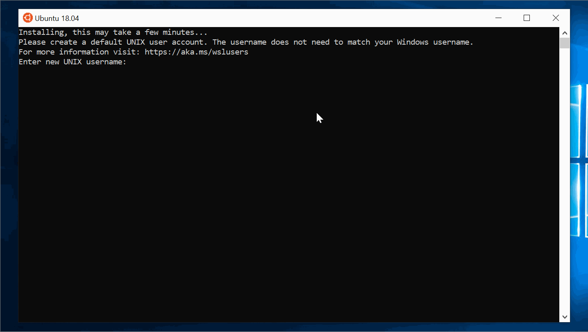

# Windows Instructions

This guide provides instructions for setting up your PC for development. Please note that although many parts of the instructions include helpful images an animations, the instructions **must** be read and followed step-by-step to ensure correct setup.

## Double-checking System Requirements

- **Windows 10** - 64-bit Home or Pro
- 8 GB or more of RAM
- 10 GB or more of free disk space

Information about your computer can be found by:
  1. Opening the **Control Panel** app
  2. Clicking on **System and Security**
  3. Then clicking on **System**


To check your available disk space, open **File Explorer** and click on **This PC**.

**Note:** If you have less than 10 GB of available disk space, you can move your media files to a personal external hard drive or another home computer. Additional space can be freed by uninstalling applications not needed for your work, studies, or LearningFuze instruction.


---

## Enabling Windows Subsytem for Linux

1. Open the **Control Panel** app.
2. Click on **Programs**.
3. Under **Programs and Features** click **"Turn Windows features on or off"**.
4. In a few moments, a list of checkboxes will appear.<br/>
   Be sure that **Windows Subsystem for Linux** is _checked_.
5. A system restart is _required_ to continue. Restart your computer now.


---

## Installing Ubuntu 18.04

1. Open the **Microsoft Store** app.
2. Search for Ubuntu and Choose **Ubuntu 18.04 LTS**.
3. On the **Ubuntu 18.04** app page click the **Get** or **Install** button.
4. If you are prompted to sign in, you can just close the sign in window.
5. When Ubuntu is finished installing click the **Launch** button.
6. Ubuntu will finish installing when you launch it.


---

## Creating a User Account in Ubuntu

**Note**: The username and password must be entered as follows for successful setup.

1. When Ubuntu is ready, it will prompt you to **Enter new UNIX username**.
2. Type `dev` and press `Enter`.
3. You will then be asked to choose a password. **Note:** When you type this password, there will be no visual indication that anything is happening. This is normal.<br/> Type `lfz` and press `Enter`.
4. To confirm, type `lfz` again and press `Enter`.
5. Close **Ubuntu**.



---

## Getting the Environment Installer

1. Download the installation files <a href="https://github.com/Learning-Fuze/lfz-dev/archive/master.zip" target="_blank">here</a>.
2. Open the downloaded `lfz-dev-master.zip`
    - Drag the `lfz-dev-master` folder inside to your Desktop.
    - Rename the `lfz-dev-master` folder on your Desktop to simply `lfz-dev`.


---

## Setting Up Cmder

1. Open the `lfz-dev` folder on your Desktop.
2. Open the `__env__` folder within.
3. Open the `windows` folder within.
4. Open `cmder.zip` and drag the folder inside to your Desktop.
5. Open the `cmder` folder on your Desktop and pin **Cmder** to your Taskbar.


---

## Setting Up the Environment

1. Open **Cmder**. If you receive a warning about **ConEmu**, then click **Unblock and Continue**.
2. Paste the following command into **Cmder**. You can right-click the Cmder prompt to paste it in. Then press `Enter`.
    ```bash
    sudo bash "$(wslpath "$(cmd.exe /C "echo %USERPROFILE%\Desktop\lfz-dev\__env__\windows\install.bash")" | tr -d '\r')"
    ```
3. If you are prompted for a password, then type `lfz` and press `Enter`. **Note:** When you type this password, there will be no visual indication that anything is happening. This is normal.
4. Good job! You can take a break, 'cause this may take a while!
5. Once installation is complete, close **Cmder**.


---

## Testing Your Environment

1. Reopen **Cmder**, type the following command, and press `Enter`.
    ```shell
    sudo service apache2 start
    ```
2. Type the following command and press `Enter`.
    ```shell
    sudo service mysql start
    ```
3. Once `apache2` and `mysql` are successfully started, type the following command and press `Enter`.
    ```shell
    http localhost
    ```
    An HTML document should print out that includes **"Connected to MySQL successfully!"**.


4. Open your web browser and go to `http://localhost`. You should see the same HTML document, but presented to you as a web page.
5. Open a new tab in your web browser, go to `http://localhost/phpmyadmin`, and log in with the username `root` and the password `root`.


---

## Done!

Your development environment is ready!

The Apache Web Server and MySQL Database Server are not started automatically when you enter the development environment via **Cmder**. They may already be running, but you'll want to learn the following commands to check, start, or stop them.

```shell
# to check if Apache is started
sudo service apache2 status

# to start Apache
sudo service apache2 start

# to stop Apache
sudo service apache2 stop

# to check if MySQL is started
sudo service mysql status

# to start MySQL
sudo service mysql start

# to stop MySQL
sudo service mysql stop
```
